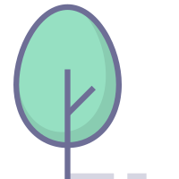

# Forest

 Forest is a high-performance
gateway.

## ✨ Features

- Supports multiple downstream node load balancing and provides a variety of load balancing strategies, such as random rounds, sequential rounds, consistent hash and weighted rounds.
- Supports Grpc, Tcp and Http protocol request forwarding with minimal overhead.
- Supports actively monitoring and probing the status of downstream nodes and updating the node status in real time.
- Supports distributed flow limiting in different level, such as second level flow limiting, hour level flow limiting and day level flow limiting.
- Supports multi-tenant authentication and authorization
- Supports protocol headers conversion
- Supports QPS statistics
- Support one-dimensional RPC and streaming RPC middleware.

## System Architecture


## 🚀 Deploy

### Binary Executables

Mac/Linux:

```shell
sh goBuildUnix.sh
```

Windows:

```shell
./goBuildWin.bat
```

### K8s (Without Persistent Storage)

```shell
kubectl apply -f KubernetesDashboard.yaml
kubectl apply -f KubernetesProxy.yaml
```

### K8s (With Persistent Storage)

PV and PVC is used to persistent storage log files.

```shell
kubectl apply -f KubernetesDashboardWithPv.yaml
kubectl apply -f KubernetesProxyWithPv.yaml
```

### Docker

- **forest-gateway-dashboard:latest**
- **forest-gateway:latest**

```shell
sh linuxDockerBuild.sh
```

## 🛠️ Install

1. git clone

```shell
git clone https://github.com/Ryan-eng-del/Forest.git
```

2. install dependencies

```shell
export GO111MODULE=on && export GOPROXY=https://goproxy.cn
cd Forest
go mod tidy
```

3. customize config file in conf/dev | conf/prod

```shell
mysql.toml
redis.toml
proxy.toml
base.toml
```

4. start server

**start control panel server**

```shell
go run main.go run -c ./conf/dev/ -p control
```

**start proxy server**

```shell
go run main.go run -c ./conf/dev/ -p proxy

```

**start proxy server and panel server**

```shell
go run main.go run -c ./conf/dev/ -p both
```

## 📜 Representations

Forest gateway project is extracted from my company's gateway business, of course, at the same time, also refer to the online implementation of many gateway components, special thanks to the didi company's GateKeeper, gave me a lot of reference ideas. The future plan is to add business testing, and already performance testing.

## License

`forest gateway` is released under the Apache 2.0 license. See [LICENSE.txt](LICENSE.txt).
